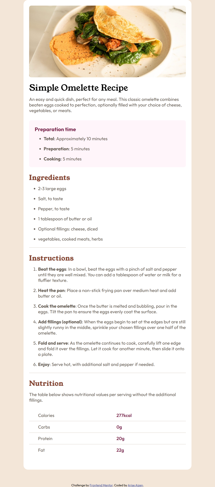

# Project List

| Project Name                         | Live Demo                                                                                                       |
| ------------------------------------ | --------------------------------------------------------------------------------------------------------------- |
| 3-column-preview-card-component-main | [Live Demo](https://arise-aizen-404.github.io/Frontend-Mentor-Challenges/3-column-preview-card-component-main/) |
| blog-preview-card-main               | [Live Demo](https://arise-aizen-404.github.io/Frontend-Mentor-Challenges/blog-preview-card-main/)               |
| calculator-app-main                  | [Live Demo](https://arise-aizen-404.github.io/Frontend-Mentor-Challenges/calculator-app-main/)                  |
| faq-accordion-main                   | [Live Demo](https://arise-aizen-404.github.io/Frontend-Mentor-Challenges/faq-accordion-main/)                   |
| interactive-rating-component-main    | [Live Demo](https://arise-aizen-404.github.io/Frontend-Mentor-Challenges/interactive-rating-component-main/)    |
| nft-preview-card-component-main      | [Live Demo](https://arise-aizen-404.github.io/Frontend-Mentor-Challenges/nft-preview-card-component-main/)      |
| product-preview-card-component-main  | [Live Demo](https://arise-aizen-404.github.io/Frontend-Mentor-Challenges/product-preview-card-component-main/)  |
| qr-code-component-main               | [Live Demo](https://arise-aizen-404.github.io/Frontend-Mentor-Challenges/qr-code-component-main/)               |
| recipe-page-main                     | [Live Demo](https://arise-aizen-404.github.io/Frontend-Mentor-Challenges/recipe-page-main/)                     |
| results-summary-component-main       | [Live Demo](https://arise-aizen-404.github.io/Frontend-Mentor-Challenges/results-summary-component-main/)       |
| social-links-profile-main            | [Live Demo](https://arise-aizen-404.github.io/Frontend-Mentor-Challenges/social-links-profile-main/)            |
| advice-generator-app-main            | [Live Demo](https://arise-aizen-404.github.io/Frontend-Mentor-Challenges/advice-generator-app-main/)            |
| huddle-react-main                    | [Live Demo](/)                                                                                                  |

---

## 3-column-preview-card-component-main

This project involves creating a responsive 3-column preview card component using HTML and CSS. It allows for showcasing different products or services with brief descriptions and images in a visually appealing layout.

### Description

The 3-column preview card component project focuses on designing an elegant and functional UI component that effectively presents information about various products or services. It includes features such as hover effects and responsive design to enhance user interaction and experience.

### Output

---

## blog-preview-card-main

The blog preview card project aims to create a visually appealing card component for displaying blog posts or articles. It includes features such as thumbnail images, titles, and excerpts to provide users with a preview of the content.

### Description

The blog preview card project focuses on designing a clean and informative UI component that entices users to explore the full blog post. It utilizes CSS flexbox or grid layout to achieve a responsive and visually pleasing card structure.

### Output

---

## calculator-app-main

The calculator app project involves building a basic arithmetic calculator application using HTML, CSS, and JavaScript. It provides users with a simple yet functional tool for performing mathematical calculations.

### Description

The calculator app project focuses on creating a user-friendly interface for performing addition, subtraction, multiplication, and division operations. It includes features such as keyboard support and error handling to ensure smooth user interaction.

### Output

---

## faq-accordion-main

The FAQ accordion project aims to create an interactive accordion component for displaying frequently asked questions and their corresponding answers. It allows users to expand/collapse individual questions to access relevant information easily.

### Description

The FAQ accordion project focuses on designing a dynamic and intuitive UI component that enhances user experience on FAQ pages or sections. It utilizes JavaScript to toggle the visibility of answer sections and CSS transitions to provide smooth animation effects.

### Output

---

## interactive-rating-component-main

The interactive rating component project involves designing a customizable rating UI component for users to provide feedback or ratings. It includes visual elements such as stars or thumbs-up icons to indicate the rating level.

### Description

The interactive rating component project focuses on creating an engaging and visually appealing UI element that encourages user interaction. It utilizes CSS for styling and JavaScript for handling user input and updating the rating display dynamically.

### Output

---

## nft-preview-card-component-main

The NFT preview card component project aims to create a beautifully designed card component for showcasing NFT (Non-Fungible Token) collections or individual items. It includes features such as artwork images, titles, and metadata information.

### Description

The NFT preview card component project focuses on creating a visually striking and informative UI element that highlights the unique attributes of NFTs. It utilizes modern design principles and CSS animations to captivate users' attention and encourage exploration.

### Output

---

## product-preview-card-component-main

The product preview card component project involves creating a responsive card component for showcasing products or items in an e-commerce website or application. It includes product images, titles, prices, and brief descriptions.

### Description

The product preview card component project focuses on designing an eye-catching and informative UI element that attracts potential customers and encourages product discovery. It utilizes CSS flexbox or grid layout to ensure consistency and responsiveness across different devices.

### Output

---

## qr-code-component-main

The QR code component project involves implementing a QR code generator or scanner functionality using HTML, CSS, and JavaScript. It allows users to generate QR codes for various purposes or scan existing codes for information retrieval.

### Description

The QR code component project focuses on creating a versatile and user-friendly tool for working with QR codes. It includes features such as customizable QR code generation parameters and real-time scanning capabilities using device cameras.

### Output

---

## recipe-page-main

The recipe page project aims to create a visually appealing and informative webpage for sharing cooking recipes. It includes ingredients, instructions, cooking tips, and images to guide users through the recipe preparation process.

### Description

The recipe page project focuses on designing a user-friendly and engaging interface that makes cooking recipes accessible to users of all skill levels. It utilizes HTML for content structure, CSS for styling, and JavaScript for interactive features such as ingredient toggling or recipe filtering.

### Output

---

## results-summary-component-main

The results summary component project involves creating a dynamic UI component for displaying summary information or statistics. It provides users with a concise overview of data or findings in a visually appealing format.

### Description

The results summary component project focuses on designing a flexible and customizable UI element that can adapt to different data types and presentation requirements. It utilizes CSS for styling and JavaScript for dynamic content generation or updating based on user input.

### Output

---

## social-links-profile-main

The social links profile project aims to create a visually appealing and interactive UI component for displaying social media profile links. It includes icons or logos for various social platforms and allows users to navigate to the respective profiles.

### Description

The social links profile project focuses on designing a modern and user-friendly interface that enhances personal or professional profiles on websites or online portfolios. It utilizes CSS for styling and provides hover effects or animations to improve user engagement.

### Output

## advice-generator-app-main

### Output

## huddle-react-main/aa-huddle-react.netlify.app\_.png

### Output

### Copyright

Copyright © [2024] [arise-aizen](https://github.com/arise-aizen-404).

This repository contains various projects created by [arise-aizen](https://github.com/arise-aizen-404). These projects are provided for educational and demonstration purposes only. You are welcome to explore, modify, and use the code for your own projects as per the terms of the license agreement. However, please refrain from using the projects for commercial purposes without proper attribution.

For inquiries or collaborations, please contact [maheshmahesh6336.6336@gmail.com].
